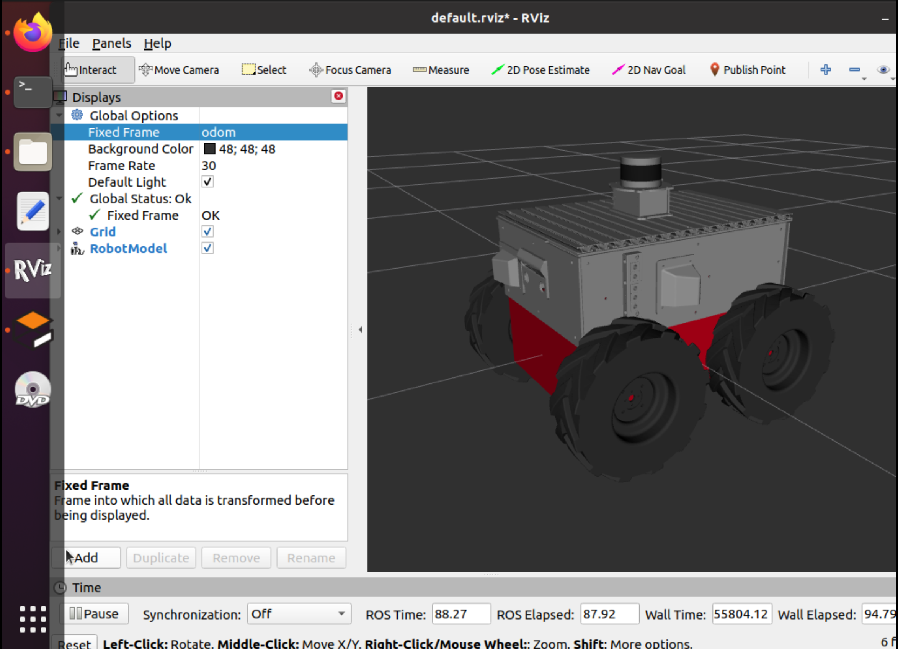
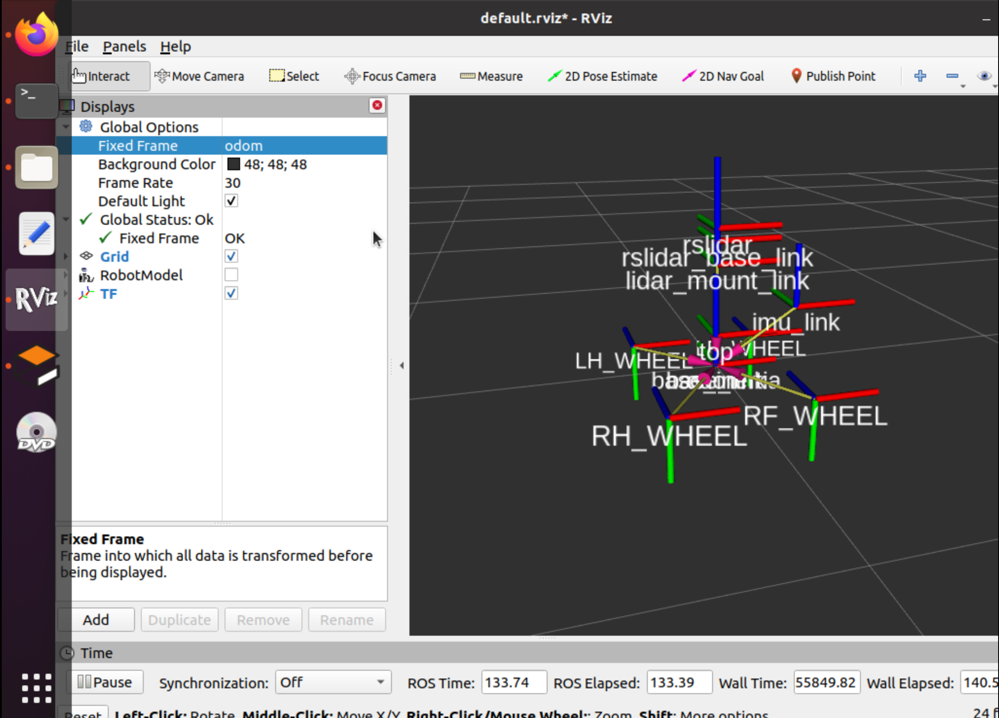

# ROS #

### Exercise Session 3


> **NOTE:** In smb_common_v2, Publish frame odom on tf is disabled, because of which "odom" was not accessible in Rviz by default, So i commented out *line 14* in **smb_common_v2/smb_control/conig/contol.yaml**   


<br><br>
<u> contol.yaml </u>
```
.
.
.
.
12  cmd_vel_timeout: 0.25
13  velocity_rolling_window_size: 2
14  #enable_odom_tf: false           <------NOTE
.
.
.
```

> **NOTE:** You have to enter "start" in terminal to get the robot moving. This is the change I did by adding a check condition in <a href="./files/smb_highlevel_controller/src/smb_highlevel_controller_node.cpp">mb_highlevel_controller_node.cpp</a>

<hr>
<hr>

### **1 )**  

Downloaded ***smb_common_v2*** file and replaced the old ***smb_common*** with it. Then built the workspace.

<hr>

### **2 )**  

Modified the launch file according to the question and saved ***singlePillar.world*** in ***worlds*** folder in ***smb_highlevel_controller***.

> click to see <a href="./files/smb_highlevel_controller/launch/mylaunchfile(modified).launch">mylaunchfile(modified).launch</a>

<hr>

### **3 )**  

Extracted the position of the pillar in robot's frame using basic trigonometry which can be seen in ***SmbHighlevelController.cpp*** in the **scan callback function** under the comment `// Extracting Pillar Position w.r.t Robot` *(line 45*)

> click to see <a href="./files/smb_highlevel_controller/src/SmbHighlevelController.cpp">SmbHighlevelController.cpp</a>

<hr>

### **4 )**

Created a publisher on the topic /cmd_vel and can be seen under the comment `// Creating a publisher on the topic /cmd_vel to send a twist command to SMB` in <a href="./files/smb_highlevel_controller/src/SmbHighlevelController.cpp">SmbHighlevelController.cpp</a> *(line 16)*.   
<br>
Added **geometry_msgs** as a dependency to <a href="./files/smb_highlevel_controller/CMakeLists.txt">CMakeLists.txt</a> *(line 11 & 24)* and <a href="./files/smb_highlevel_controller/package.xml">package.xml</a> *(line 13)*.

<hr>

### **5 )**

Written a Proportional controller code that drives the robot and the angular velocity is proportional to the error that the angle has at that moment, this can be seen under the comment `// Proportional controller that drives the robot `in <a href="./files/smb_highlevel_controller/src/SmbHighlevelController.cpp">SmbHighlevelController.cpp</a> *(line 57)*.   
<br>
And to ensure that the pillar is well visible, some **laser_scan** arguments were passed ***smb_gazebo.launch*** in <a href="./files/smb_highlevel_controller/launch/mylaunchfile(modified).launch">mylaunchfile(modified).launch</a> *(line 7 & 8)*.

<hr>

### **6 )**



<hr>

### **7 )**



<hr>

### **8 )**

To Publish a visualization marker for RViz that shows the estimated position of the pillar first I  advertised on the **visualization_marker** topic in <a href="./files/smb_highlevel_controller/src/SmbHighlevelController.cpp">SmbHighlevelController.cpp</a> *(line 19)* under the comment `// Creating a publisher on the topic /visualization_marker display a marker in Rviz` Then I wrote the rest of the code under the comment `// Publishing a visualization marker for RViz that shows the estimated position of the pillar.` in <a href="./files/smb_highlevel_controller/src/SmbHighlevelController.cpp">SmbHighlevelController.cpp</a> *(line 72)*.

<hr>

**Don't** forget to update <a href="./files/smb_highlevel_controller/include/smb_highlevel_controller/SmbHighlevelController.hpp">SmbHighlevelController.hpp</a> to include all the necessary declarations.

<hr>
<hr>

## See The Final Simulation

https://github.com/Ronit-k/Induction_Y23/assets/162661711/e1ae560c-b2fd-44eb-9671-7f7d423b64c1

