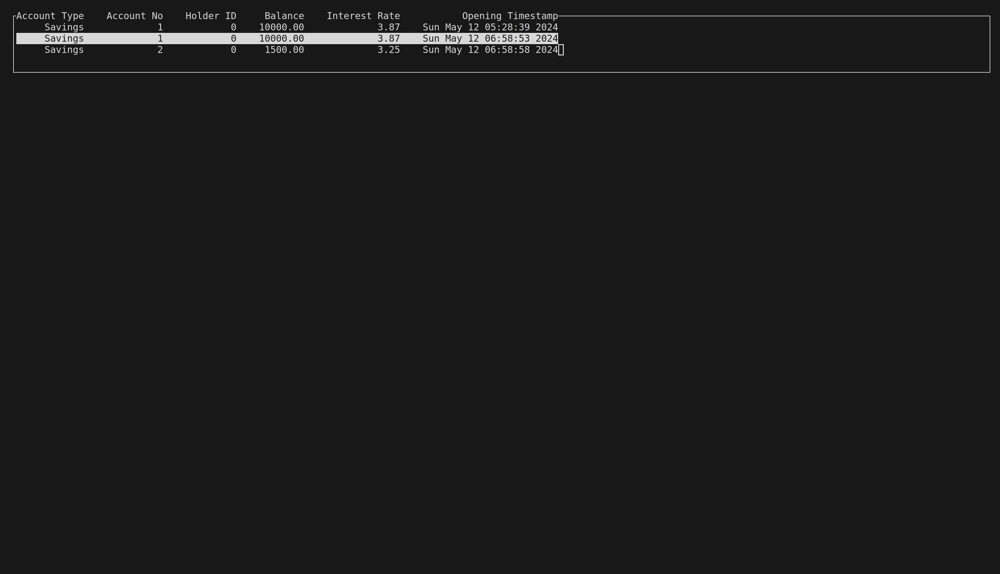

# World Bank
A TUI based app for ARIITK's Assignment on OOPS. It features a TUI using ncurses with menu's similar to CLI interfaces and table layouts. Code needs cleaning up since I made this in a rush :)


## Fast Forwarding
The fast forwarding compounds per year, so for every set of 365 days, the balance is increased by `interest rate%`, and the date upto which the balance is updated is stored. So fastforwarding 1000 days compounds it twice, and 95 days again will count it as a third.

# Running It

## Get the Prereqs
### Ubuntu/Debian (apt):
```bash
sudo apt-get install ncurses-dev
```

## Clone and Compile and Run
```bash
git clone --branch ravi_a https://github.com/PhantomzBack/Induction_Y23
cd Induction_Y23
g++ src/main.cpp -lncurses && ./a.out
```


