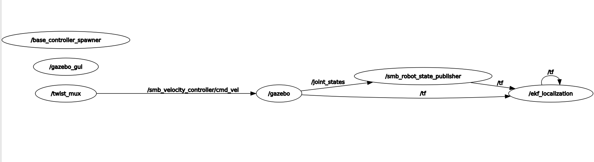
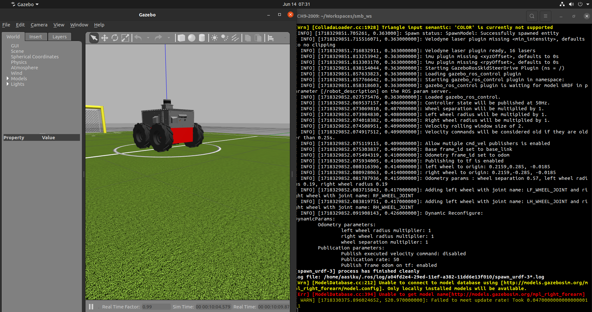

# ROS Assignment 1  

Made a  VM of Ubuntu 20.04  
Did the following things to setup the machine:
* installed ros noetic according to instructions on roswiki
* Made git and Workspace directory as instructed  
    ```bash
    mkdir ~/git
    mkdir ~/Workspaces/smb_ws/src
    ```

## Question 1  

* Downloaded the smb_commons zip file and extracted it   
* Made soft link to the smb_common dir in git dir, to src dir
    ```bash
    ln -s ~/git/smb_common ~/Workspaces/smb_ws/src
    ```
* Build the smb_gazebo package using 
    ```bash
    catkin build smb_gazebo #Was currently inside ~/Workspace/smb_ws folder 
    ```  
    

* Then sourced using source devel/setup.bash 
* Ran `rosdep install --from-paths src --ignore-src -r -y` and `sudo apt install ros-noetic-gazebo-plugins` to install dependencies    
* Used `roslaunch smb_gazebo smb_gazebo.launch` to open empty world
    


## Question 2

Executed the commands given in the question   
> Outputs
1. `rosnode list and rostopic list`
    
2. `rostopic echo /clock`  
    
3. `rostopic hz /clock `  
    
4. `rqt_graph`
    


    

## Question 3

Knowing the name of the topics, checked the type of the message in /cmd_vel
using `rostopic info /cmd_vel`      
* Came out to be geometry_msg/Twist    


* Ran `rosmsg show geometry_msgs/Twist`   
    > geometry_msgs/Vector3 linear   
        float64 x   
        float64 y   
        float64 z   
    > geometry_msgs/Vector3 angular   
        float64 x   
        float64 y   
        float64 z

* Used command `rostopic pub -r ` to command a desired velocity 
    ```bash
    rostopic pub /Twist "{linear: {x: 1.0, y: 0.0, z: 0.0}, angular: {x: 0.0, y: 0.0, z: 0.0}}" -r 2 #-r sets the frequency.
    ```    


## Question 4

Git cloned [repo](https://github.com/ros-teleop/teleop_twist_keyboard)  
Then followed similar steps as in question to build package teleop_twist_keyboard  
Ran it using `rosrun teleop_twist_keyboard teleop_twist_keyboard.py`  

## Question 5

* Made the launch file in smb_gazebo folder,and rebuilt it.
    ```bash
    <?xml version="1.0" encoding="utf-8"?>

    <launch>
            <include file="$(find smb_gazebo)/launch/smb_gazebo.launch">
                    <arg name="world_file" value="worlds/robocup14_spl_field.world"/>
            </include>
    </launch>
    ```
* Launched with `roslaunch smb_gazebo <Launch_file_name>.launch`
    
    