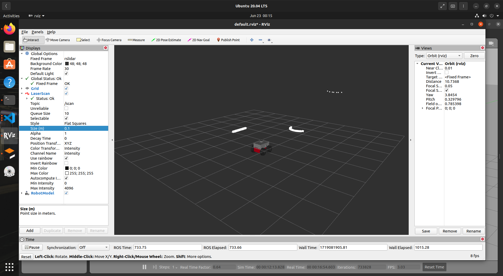
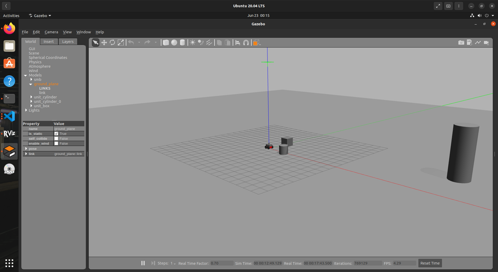
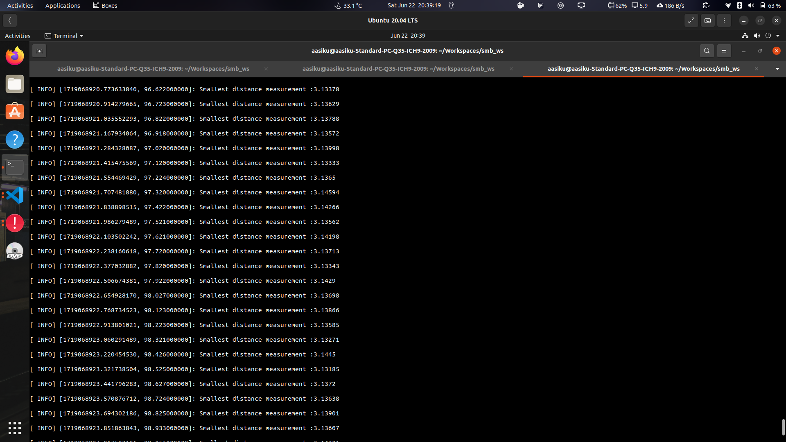

# ROS Assignment 2  

Continued with VM of Ubuntu 20.04, used in assignment 1  
Did the following things to setup the machine:
* Installed the zip file given file `smb_highlevel_controller.zip`, unziped it and made a softlink to `~/Workskspace/smb_ws/src`


## Question 1 ,2, 3

* Downloaded the smb_commons zip file and extracted it   
* Made soft link to the smb_common dir in git dir, to src dir
    ```bash
    ln -s ~/git/smb_common ~/Workspaces/smb_ws/src
    ```

 ## Question 4,5
* Made a [default.yaml](./smb_highlevel_controller/config/default.yaml) file inside config dir containing
    ```bash
    Topic: /scan  #Name of the topic
    queueSize: 100
    ```   
* Created subscriber in [SmbHighlevelController.cpp](./smb_highlevel_controller/src/SmbHighlevelController.cpp)
    ```bash
    subscriber = nodeHandle_.subscribe(Topic,Size,&SmbHighlevelController::scanCallback,this);
    # scanCallback is the call back function
    ```  

## Question 6
* Made a callback function named ***scanCallback*** in [SmbHighlevelController.cpp](./smb_highlevel_controller/src/SmbHighlevelController.cpp)
    ```bash
      void SmbHighlevelController::scanCallback(const sensor_msgs::LaserScan::ConstPtr& msg)
  {
    auto min= *std::min_element(msg->ranges.begin(), msg->ranges.end());
    ROS_INFO_STREAM("Smallest distance measurement :"<< min << std::endl ); 
  }
    ```    

## Question 7,8

* Added the launch file [Launch_file](./smb_highlevel_controller/launch/Launch_file.launch) with label enabled set to **true**
    ```xml
    <?xml version="1.0" encoding="utf-8"?>

    <launch>
    <include file="$(find smb_gazebo)/launch/smb_gazebo.launch">
        <arg name="world_file" value="$(find smb_gazebo)/worlds/empty.world"/>
        <arg name="laser_enabled" value="true"/>   <!--Here laser_enabled is set to true-->            
    </include>
    
    <node pkg="smb_highlevel_controller" type="smb_highlevel_controller_node" name="smb_highlevel_controller" output="screen"> <!--Set to use smb_highlevel package-->
        <rosparam command="load" file="$(find smb_highlevel_controller)/config/default.yaml" />
    </node>
    
    <node pkg="rviz" type="rviz" name="rviz"/> <!--Launching rviz along the launch file-->
    </launch>

    ```
* Added add_executable and target_link_libraries in cmake, without it Executable of cpp code inside src were not being made.
    ```bash

    # Declare a C++ executable
    add_executable(smb_highlevel_controller_node
    src/smb_highlevel_controller_node.cpp
    src/SmbHighlevelController.cpp)

    # Specify libraries to link a library or executable target against
    target_link_libraries(smb_highlevel_controller_node
    ${catkin_LIBRARIES})
    ```
## Results:

### Rviz 

### Gazebo

### Shortest Distance
