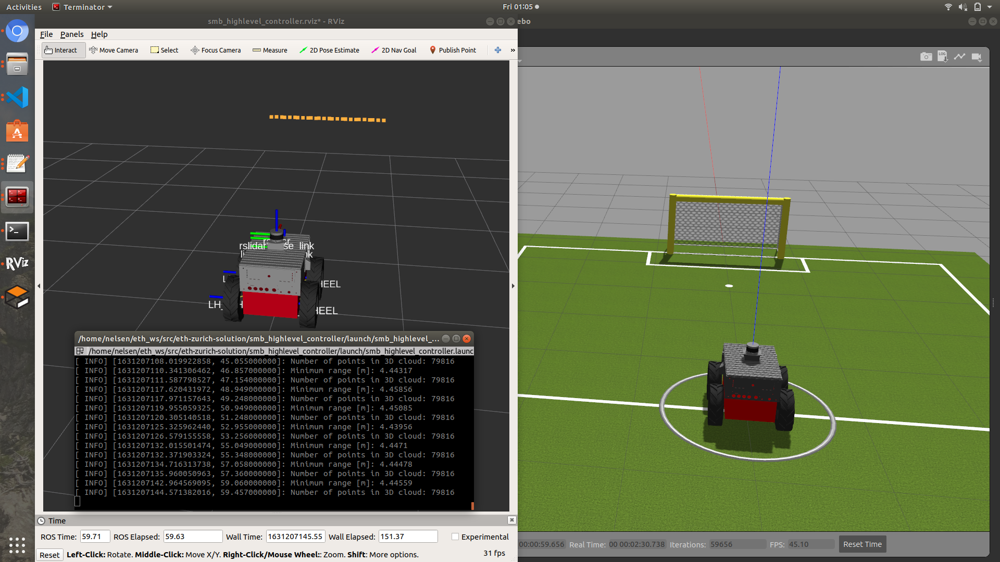
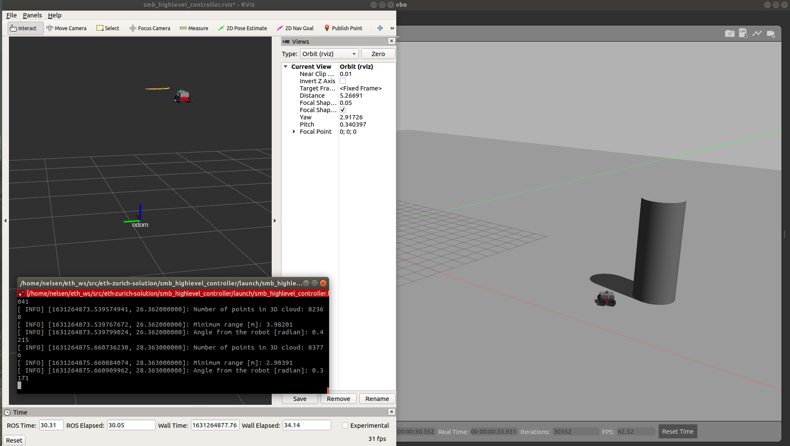
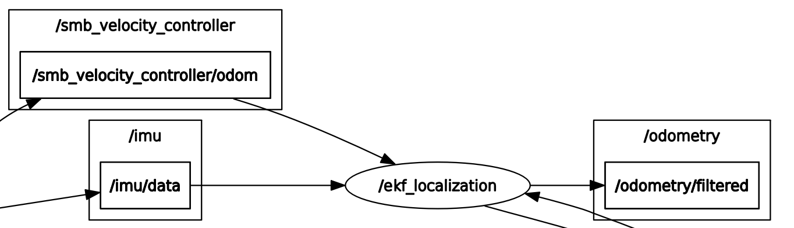
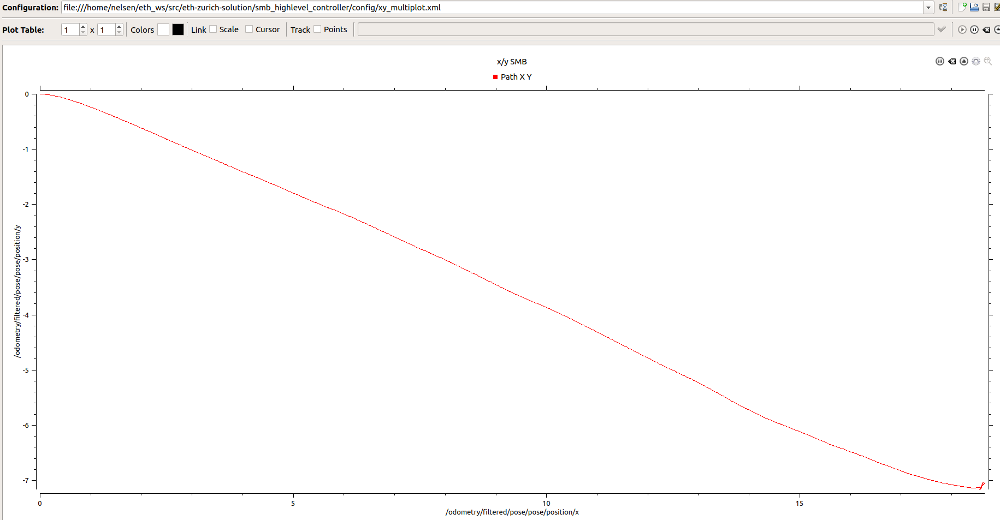
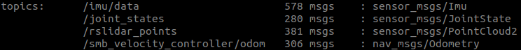
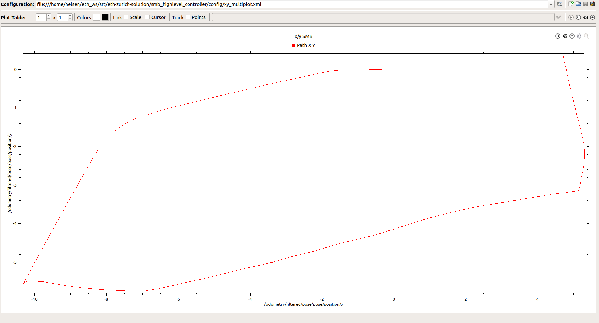
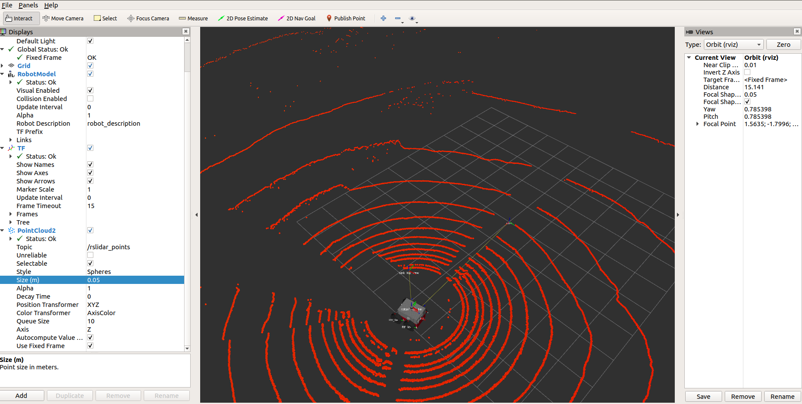

## [Exercise 2]

Run the launch file with the following command:

`roslaunch smb_highlevel_controller smb_highlevel_controller.launch`

The solution package template is based on [ros_best_practices for python](http://www.artificialhumancompanions.com/structure-python-based-ros-package/)

### Output
The solution output should be as follow:
||
|:--:|
| <b>Rviz with laserscan, terminal with output and gazebo</b>|

##### pointcloud_to_laserscan
.png)|

As can be seen from the `rqt_graph`, the `pointcloud_to_laserscan` node is subscribing to `/rslidar_points` which is a `PointCloud2` message and `/tf` and converts it into a `LaserScan` topic `/scan`.

### Files
#### default_parameters: 
* consist of parameters that are passed to the launch file.

#### smb_highlevel_controller: 
* Initialize the `smb_highlevel_controller` node

#### SmbHighlevelController
* Implementation of the class method including fetch parameters from launch
* Subscribe to topics name based on parameters server
* Implementation of callback method such as `scanCallback` and `pclCallback`.

#### smb_highlevel_controller:
* Add `<rosparam>` to load to parameter server.
* Add `node` to launch  script.

#### CMakeLists:
* Add `find_package` and `catkin_package` to find libraries such as `rospy` and `sensor_msgs`.
* Install python executable based on the project name with `catkin_install_python` .
* Add `depend` for the dependencies which are `rospy`, `sensor_msgs` and `smb_gazebo`
  
## Exercise 3
**Note: Change `smb_common` package to `smb_common_v2` package**

Run the launch file with the  following command:

`roslaunch smb_highlevel_controller smb_highlevel_controller.launch`

### Output
The solution output should be as follow:
||
|:--:|
| <b>Rviz with marker visualization indicate with the green color ball and tf marker, terminal with printed output such as the angle , and smb is heading towards the pillar in gazebo</b>|

### Files
#### CMakeLists.txt:
* Add dependencies such as `geometry_msgs`, `tf2_ros`, and `visualization_msgs` package.

#### SmbHighlevelController:

* Import `geometry_msgs`, `tf2_ros`, and `visualization_msgs` package.
* Add two publisher for topics `visualization_marker` and `cmd_vel` during initialization.
* Create a `goal_pose` of type `geometry_msgs::PoseStamped` which is the pillar from the lidar reading with respect to the `rslidar` frame.
* Create TF listerner and TF buffer to transform the `goal_pose` from the `rslidar` frame to `odom` on `transform_odom`.
* Utilize a P controller from the error angle to drive the error to zero on `move_to_goal`, the x velocity is set to constant without P controller to ensure that the SMB hits the pillar.
* Publish a visualization marker on `vis_marker_publish` that can be displayed in Rviz.

#### smb_highlevel_controller:
* Change the world argument value to `"$(find smb_highlevel_controller)/world/singlePillar.world"`
* Add two arguments under `laser_scan_min_height` and `laser_scan_max_height` to -0.2 and 1.0 respectively.
* Remove the `teleop_twist_keyboard` node from the launch.
* Add `Marker` display to visualize the pillar marker indicated with green color ball.

## [Exercise 4]

This exercise requires the use of rqt_multiplot. Run the following command to install rqt_multiplot:
`sudo apt install -y ros-<distro>-rqt-multiplot`

where `<distro>` can be either melodic or noetic based on your computer ROS_DISTRO.
### Simulation
The simulation can be run with the following command:
`roslaunch smb_highlevel_controller smb_highlevel_controller.launch`
#### EKF Localization Node
To understand the EKF Localization Node, open another terminal, then open it with `rqt_graph`.

The output is the following:
||
|:--:|
| <b>ekf_localization node in rqt_graph</b>|

As can be seen from the graph, the ekf localization subscribes to `/imu/data` and `/smb_velocity_controller/odom` topics and publishes `/odometry/filtered` topic by applying extended kalman filter. In this case, the topic will be displayed in both rqt_multiplot and rviz.

#### Plot of simulation x/y-plane
The solution output should be as follow:
||
|:--:|
| <b>Plot of x/y-plane that is taken by SMB (Kp = 30, x_vel = 3 m/s) until it hits the pillar on rqt_multiplot</b>|

### Recorded (rosbag)
#### ROS Topic inside `smb_navigation.bag`
To get all the topics and messages inside the rosbag, run the following command:

`rosbag info smb_navigation.bag`

The solution should be as follow:

To run the recorded rosbag, use the following command:

`roslaunch smb_highlevel_controller ekf_localization.launch`

#### Plot of recorded x/y-plane
The solution output should be as follow:
||
|:--:|
| <b>Plot of x/y-plane plot that is taken by SMB until the rosbag recording ends</b>|

#### Visualization of 3D point cloud and TF marker in Rviz
The 3D point cloud as well as `smb_top_view` frame can be visualize in rviz:
||
|:--:|
| <b>3D lidar point cloud and smb_top_view frame visualize in rviz</b>|

The `smb_top_view` frame will move according to the `base_link` frame. As such, the `smb_top_view` is moving together with the robot in rviz when the rosbag is played.

### Files

#### smb_navigation:
* Contains 59.7 seconds of a recorded simulation.
* The size of the bag is 158.9 MB with total messages of 1545.
* The topics recorded are `/imu/data`, `join_states`, `rslidar_points`, and `smb_velocity_controller/odom`
#### xy_multiplot:
* Create an x/y-plane plot of the smb based on the output of the `ekf_localization` node which is `/odometry/filtered` with type `nav_msgs/Odometry`.
#### ekf_localization:
* Display TF, PointCloud2, and RobotModel of the smb
#### smb_highlevel_controller:
* Add rqt_multiplot node to plot the path of smb in x/y plane.

#### ekf_localization:
* Add `ekf_robot_localization` node and load the required parameters
* Add `smb_robot_state_publisher` to publish state of the robot to tf2 that is visualize in rviz.
* Create a frame called `smb_top_view` with `static_transform_publisher` node which is 2 meters above the `base_link` frame.
* Add `rosbag` node to play rosbag with full speed or half speed.
* Launch rviz with ekf_localization configuration.
* Add rqt_multiplot node with xy_multiplot to plot the path of smb in x/y plane.
