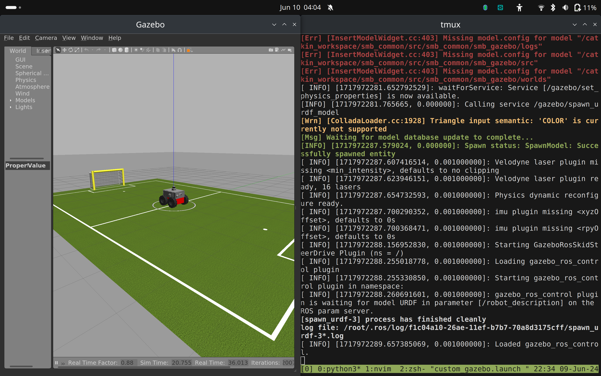

# Assignment 1

1. Installed it locally using `wget` , extracted to `/git` using `unzip`, created symlink using `ln -s`. Installed catkin build using
`sudo apt-get install python3-catkin-tools`
For building, ran `catkin build` in the parent folder of the `smb_common` folder.

2. Inspected nodes using given commands, found `/cmd_vel` to be the relevant one


3. Sending velocity over terminal to the bot.


4. TeleopTwistKeyboard


5. The launch file
```xml
<?xml version="1.0" encoding="utf-8"?>

<launch>
        <include file="$(find smb_gazebo)/launch/smb_gazebo.launch">
                <arg name="world_file" value="worlds/robocup14_spl_field.world"/>
        </include>
</launch>
```

Launch file good to go:


