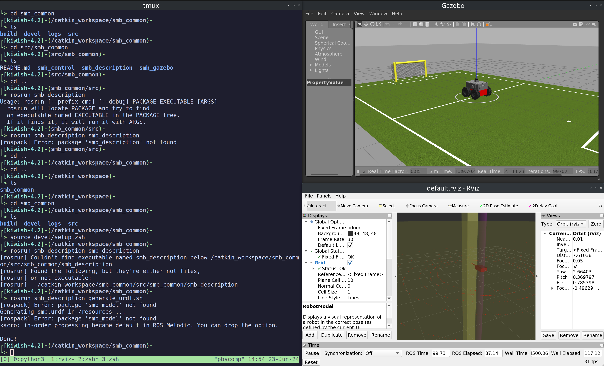

Created a package with a listener node which listens to the topic scan.


Added support for reading parameter. 


The nodes (such as `pointcloud_to_laserscan`, `smb_velocity_controller`, etc.) for creating the topic `/scan` and `/odom` weren't launching, so these commands had to be run
```bash
sudo apt-get install ros-noetic-gazebo-ros-pkgs ros-noetic-gazebo-ros-control
sudo apt-get install ros-noetic-hector-gazebo-plugins
sudo apt-get install ros-noetic-velodyne-gazebo-plugins
sudo apt-get install ros-noetic-velodyne-description
sudo apt-get install ros-noetic-teleop-twist-keyboard
sudo apt-get install ros-noetic-rviz
apt-get install ros-noetic-tf2-sensor-msgs
apt-get install ros-noetic-pointcloud-to-laserscan
apt-get install ros-noetic-twist-mux
apt-get install ros-noetic-robot-localization
apt install ros-noetic-joint-state-controller
apt install ros-noetic-diff-drive-controller
apt install ros-noetic-robot-state-publisher
```
After setting up `rviz` too, this is what it looked like.


