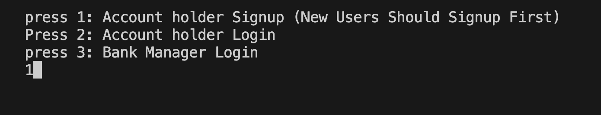
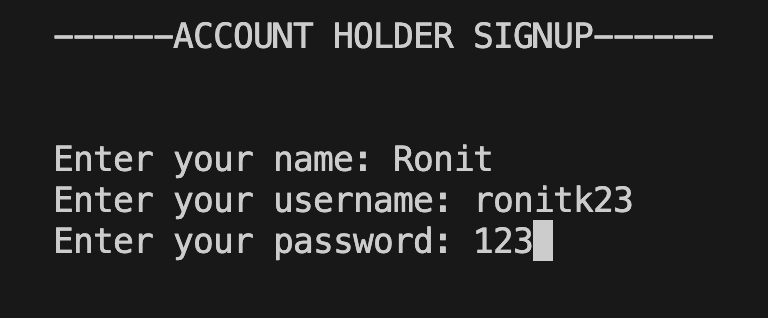
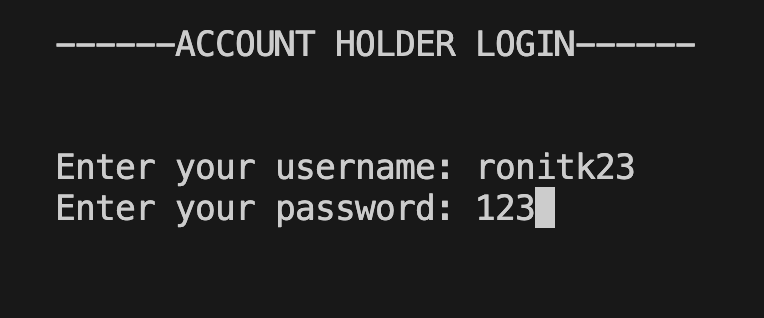
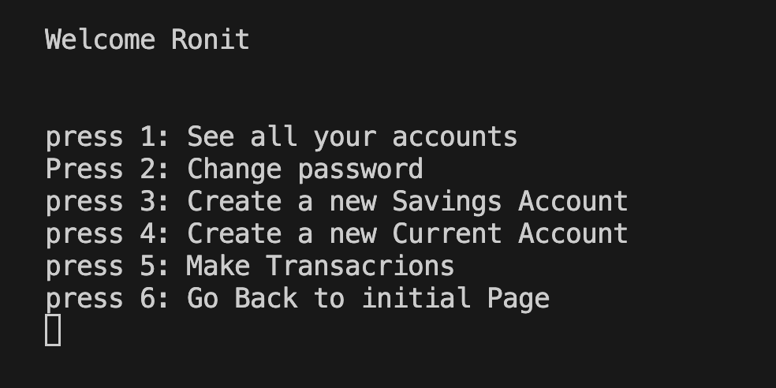
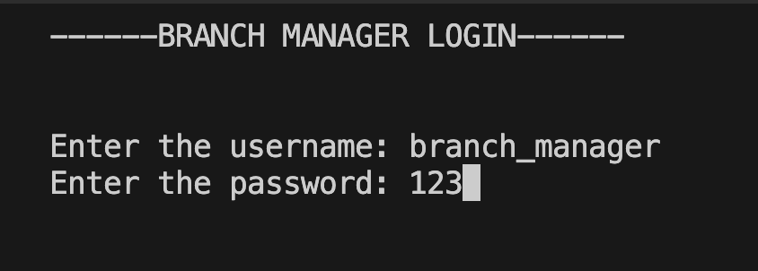
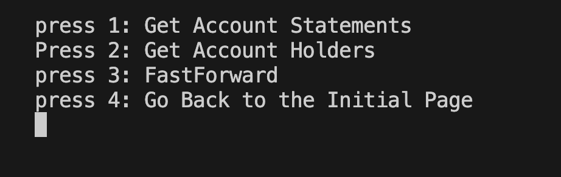

# WORLD   BANK   CLIENT

I have tried to make the program userfriendly by properly listing out the choices and clearing out the terminal when needed.  

### Credential of branch manager  
**Username:** ```branch_manager```  
**Password:** ```123```

 If it appears that the program just froze, wait for 20-30sec it will resume, I have used *sleep()*
function to give the user time to read and react. Following is an over view of the program with some photos.

---

>Intial Page:

Choosing 1 to create an account and then filling out the asked details in the signup page

>(Option 1 ) Account Holder Signup Page


---

>(Option 2) Account Holder Login Page


 we get to see the following options after logging in.


First you have to create either a savings or checkings account to make transations or view statements.

---

>(Option 3) Branch Manager Login Page

After logging in, you get the following options:


**This was just a brief overview, you'll have to run the program to explore all the features!**
