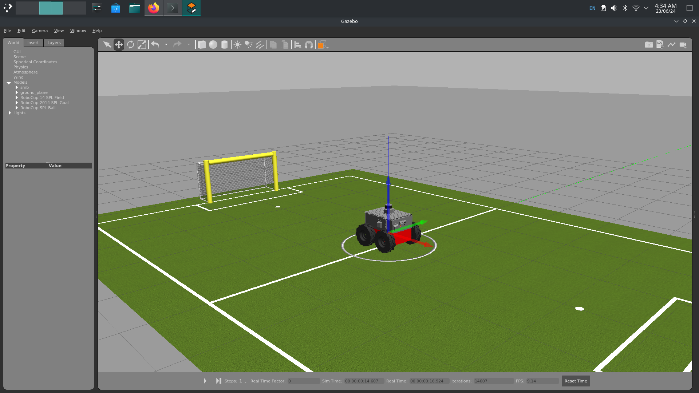
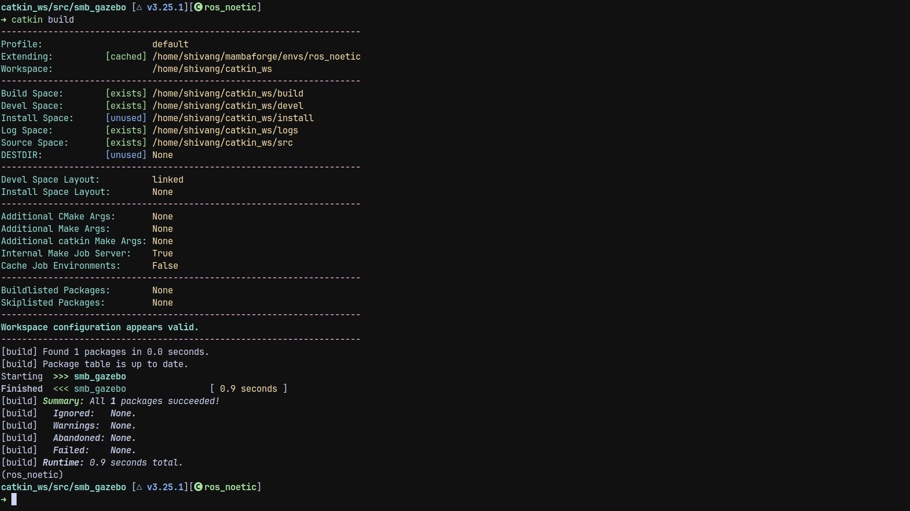
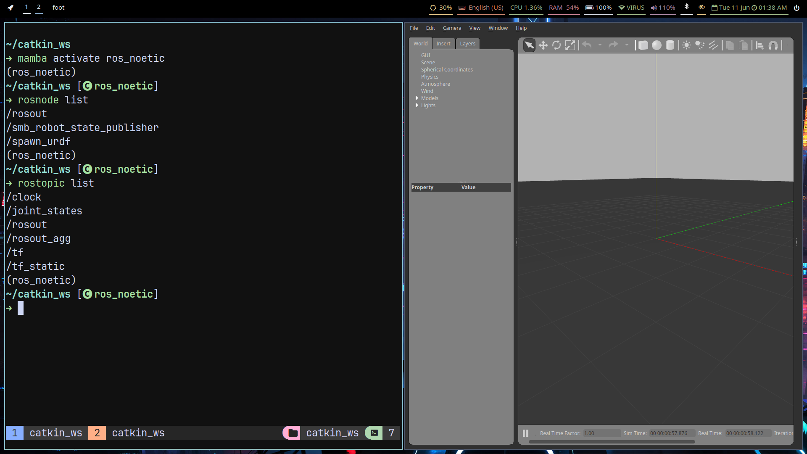
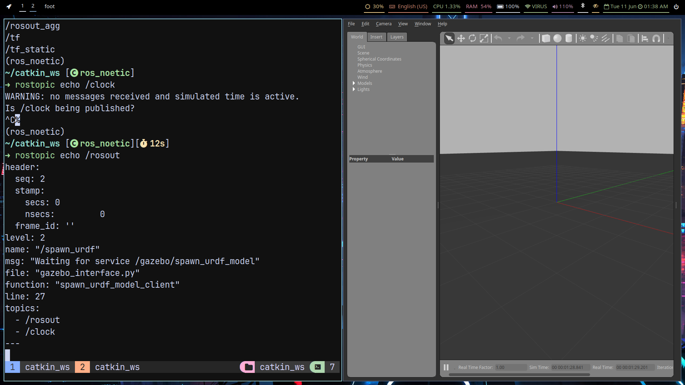
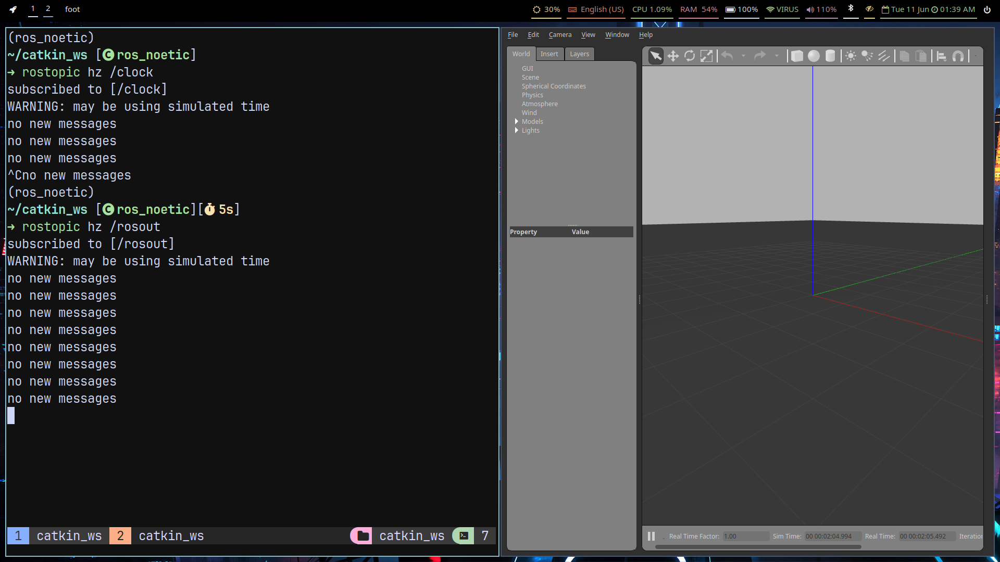
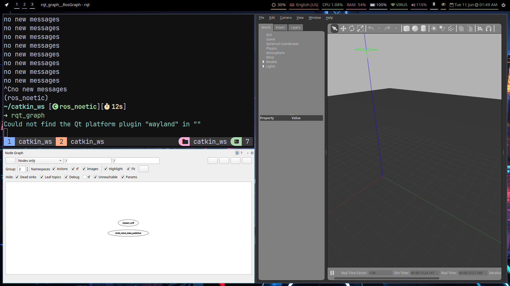

# Setup and building ROS project

## Ros  and Catkin setup
1. Following the setup given in [this](https://github.com/lesaf92/ros_noetic_ubuntu22) repo

2. Installing mamba

`curl -L -O "https://github.com/conda-forge/miniforge/releases/latest/download/Mambaforge-$(uname)-$(uname -m).sh"
bash Mambaforge-$(uname)-$(uname -m).sh`

3. Setup virtual environment with mamba
`mamba create -n ros_env python=3.9 -c conda-forge
mamba activate ros_env
conda config --env --add channels conda-forge
conda config --env --add channels robostack-staging
conda config --env --remove channels defaults
mamba install ros-noetic-desktop-full
mamba install catkin_tools
mamba install rosdep
rosdep init
rosdep update`

2. Installing ros-noetic-desktop-full with robostack instead of conda-forge

3. Creating catkin workspace

`mkdir -p ~/catkin_ws/src
cd ~/catkin_ws/src
`
4. Building with
`catkin init && catkin build`

5. Unzip the contents of smb_common in the zip file in the src directory

6. Sourcing environment with
`source devel/setup.zsh`
on zsh

7. Running smb_gazebo with roslaunch
`roslaunch smb_gazebo smb_gazebo.launch`

## RoboCup world running

## ScreenShots

